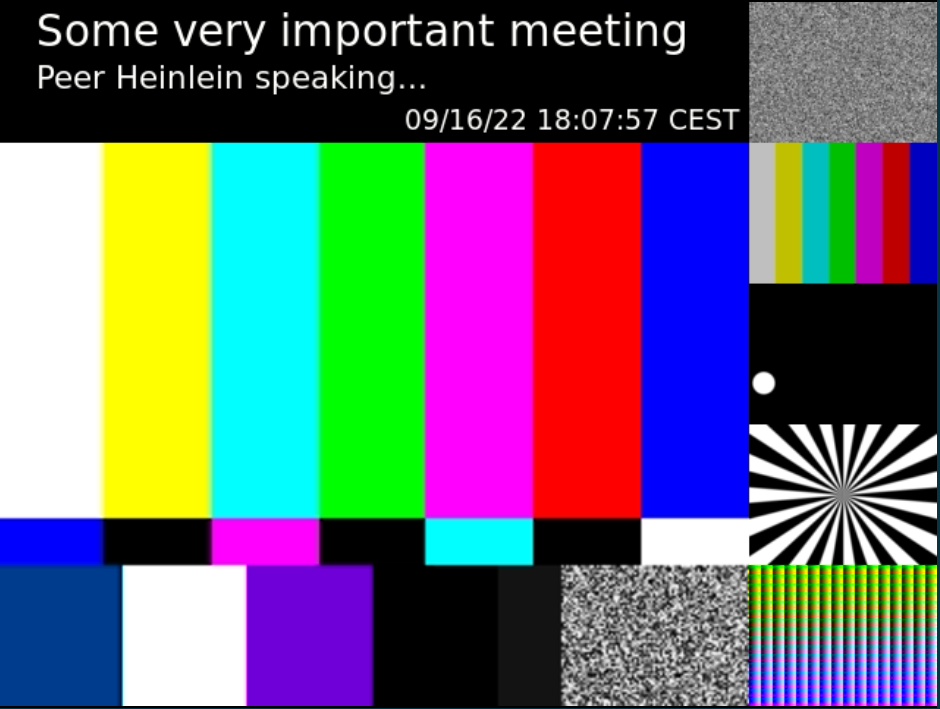
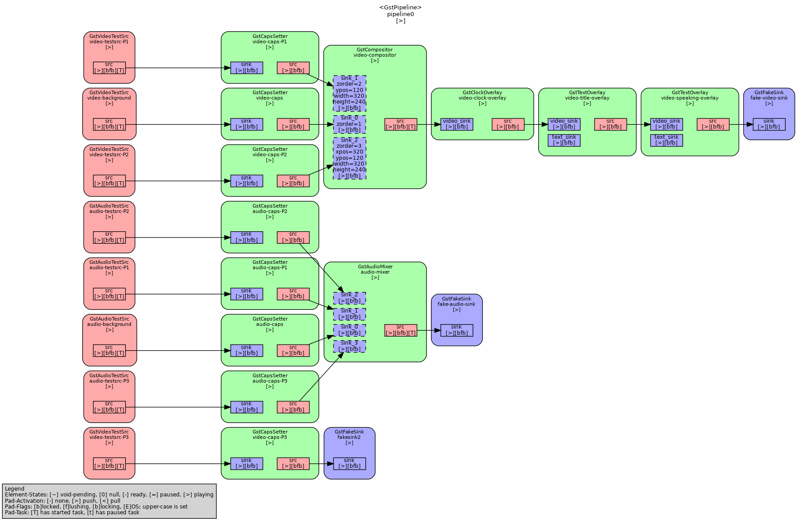

# OpenTalk Mixer

[](https://git.heinlein-video.de/p.hoffmann/recorder/-/commits/main)

## Content

- [OpenTalk Mixer](#opentalk-mixer)
  - [Content](#content)
  - [Purpose](#purpose)
  - [First Speaker Composite](#first-speaker-composite)
  - [Running](#running)
    - [Advanced options](#advanced-options)
  - [Convert Dash files into one *MP4* file](#convert-dash-files-into-one-mp4-file)
  - [GStreamer Pipeline](#gstreamer-pipeline)
  - [Known Problems](#known-problems)

## Purpose

This is a study of the recording compositor to be used in *OpenTalk Recorder*.

## First Speaker Composite

The recording composite `speaker` has slightly different look than the one used in the participants view because this study is a straight forward approach and recording composites might look different in either way because recording (or streaming) presentation usually is different to what each participant is setting up for himself. Additionally we can test if inserting text overlays with title, a clock or other useful information is wishful in recordings.



## Running

Run the program with:

```sh
RUST_LOG=INFO cargo run -- -t -d
```

This will use test sources (`-t`) and display the output on screen (`-d`). `RUST_LOG=INFO` sets the logging level to info.

```sh
RUST_LOG=INFO cargo run -- -t
```

Take away the display option and This will produce an *MPD file* `dash.mpd` and several video files named `video_1_x.ts` where `x` is an incrementing number.

The *Dash* files can be played with `mplayer` by using the following line:

```sh
mplayer dash.mpd
```

### Advanced options

```txt
compositor 0.1.1
program arguments

USAGE:
    compositor [OPTIONS]

OPTIONS:
    -d, --display
            just use video display instead of recording

    -D, --dot
            generate dot file of pipeline

    -h, --help
            Print help information

    -p, --participants <PARTICIPANTS>
            number of visible viewers (additionally to the speaker) [default: 5]

        --resolution <RESOLUTION>
            width and height (e.g. `1920x1080`) of the composite output [default: 640x480]

    -t, --test
            use test sources

    -v, --visibles <VISIBLES>
            maximum number of visible participants [default: 5]

    -V, --version
            Print version information

```

## Convert Dash files into one *MP4* file

To convert the files into one *MP4* file you need to remove the base URL from the MPD file because otherwise `ffmpeg` would not find the files (but `mplayer` need the line :/).

Remove the following XML element from the file before starting the next command.

```xml
<BaseURL>file://...</BaseURL>
```

Then use the following line to do the conversion:

```sh
ffmpeg -i dash.mpd out.mp4
```

The result is the whole video in one file named `out.mp4`.

## GStreamer Pipeline



## Known Problems

- *Dash* seems to need h264 or h265 encoding when writing files
- the *gstreamer* `dashsink` element is quite new and `mp4` muxer is still not working but `ts` does
